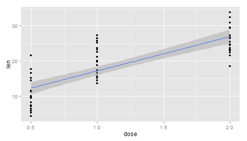

## Shiny App


This app is developed for Coursera - 'Developing Data Products' course assignment


**Applicaion:**

- Application uses ToothGrowth dataset

- Toothgrowth data is available in R datasets package

- User can look for relations in the data set 

- Different types of smoothening options are given

--- .class #id 


## About the Data

**Description**

The response is the length of odontoblasts (teeth) in each of 10 guinea pigs at each of three dose levels of Vitamin C (0.5, 1, and 2 mg) with each of two delivery methods (orange juice or ascorbic acid).

ToothGrowth: A data frame with 60 observations on 3 variables.

-    len	 numeric	 Tooth length
- 	 supp	 factor	 Supplement type (VC or OJ).
- 	 dose	 numeric	 Dose in milligrams.


--- .class #id 


## Using App

The below steps explain the usage of this app to look for bivariate relations in the data

- First select the predictor Variable 

- Select the Output variable 

- Select the type of smoothening

Smoothening

- Loess : Local Polynomial Regression Fitting
- lm : Linear Model
- glm : Generalized Linear Models

--- .class #id 


## Example 


For example to check the effect of dose on length of teeth,

- Select the predictor variable dose, len as outcome variable and select the method lm


```r
library (ggplot2)

ggplot(aes(x=dose, y = len), data = ToothGrowth) + geom_point() + geom_smooth (method = 'lm')
```

 


